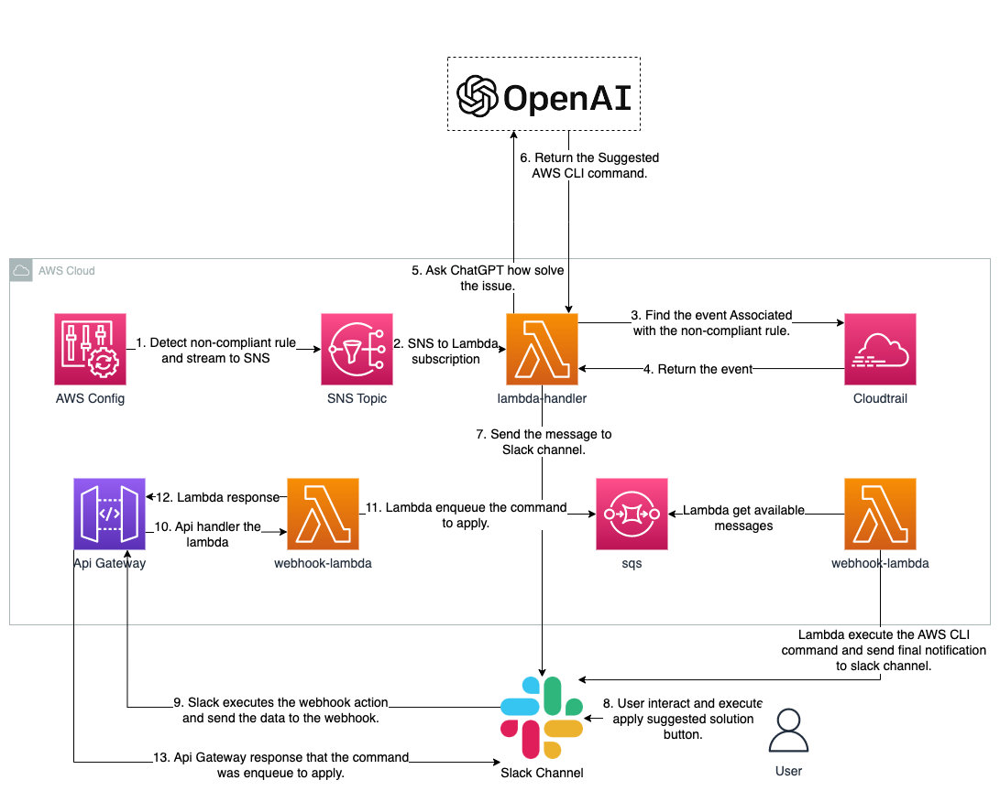

# Integrating ChatGPT API with AWS Config



## Deploying the infrastructure

1. Clone this repository in your local machine:

```javascript
glit clone https://github.com/4l3j4ndr0/aws-config-chatGPT.git
```

2. Deploy the cloudformation stack.

- Using SAM CLI: In this case you need install [AWS SAM CLI](http://docs.aws.amazon.com/serverless-application-model/latest/developerguide/install-sam-cli.html "SAM CLI")
  On the root folder execute the following command:

```javascript
sam deploy \
--template-file template.yaml \
--stack-name aws-config-stack \
--capabilities CAPABILITY_NAMED_IAM \
--parameter-overrides OpenAiApiKey=<your_api_key_open_ai>
SlackBotToken=<your_oauth_token_slack> SlackChannel=<your_slack_channel> \
--resolve-s3 \
--profile <your_aws_credentials_profile>
```

- Using AWS CLI:

```javascript
aws cloudformation deploy \
--template-file template.yaml \
--stack-name aws-config-stack \
--capabilities CAPABILITY_NAMED_IAM \
--parameter-overrides OpenAiApiKey=<your_api_key_open_ai> SlackBotToken=<your_oauth_token_slack> SlackChannel=<your_slack_channel> \
--resolve-s3 \
--profile <your_aws_credentials_profile>
```

Once the stack is deployed, execute the following AWS CLI command to obtain the API URL of the API Gateway:

```javascript
aws cloudformation describe-stacks --stack-name <your_slack_channel> --query 'Stacks[0].Outputs[?OutputKey==`ApiUrl`].OutputValue' --output text --profile sso-personal
```
